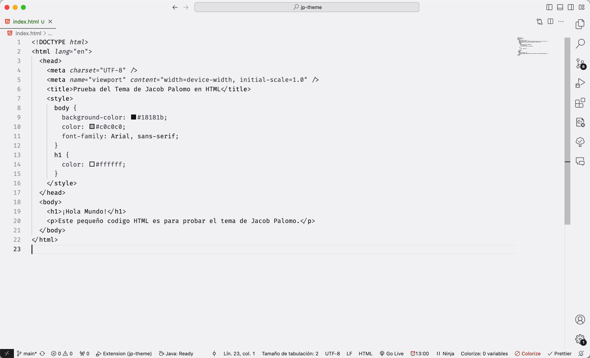
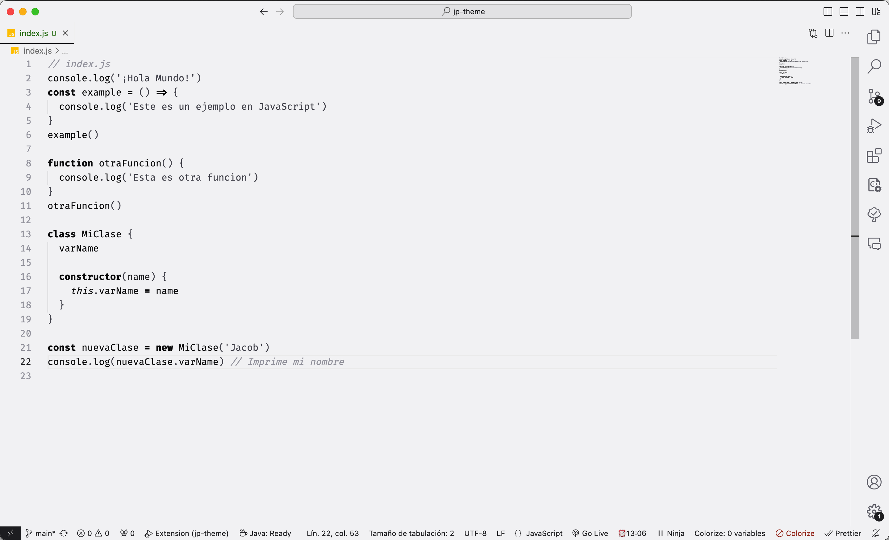
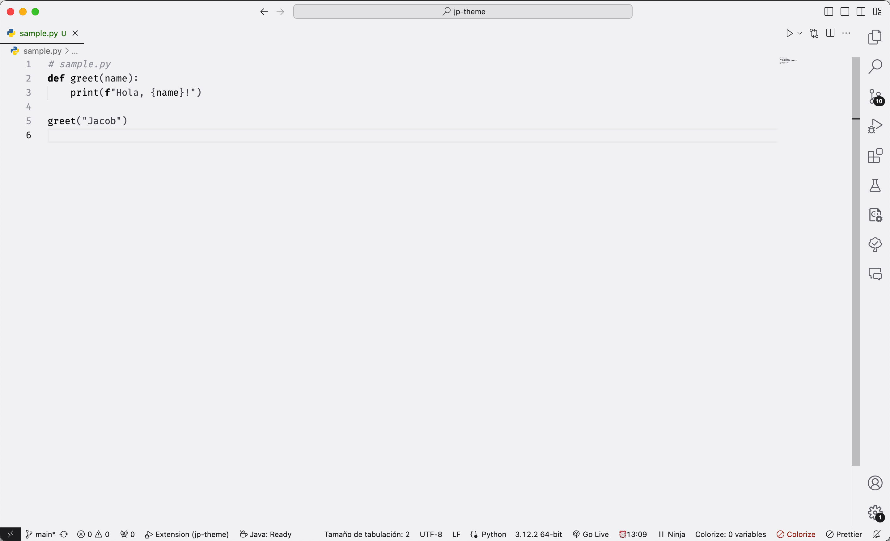
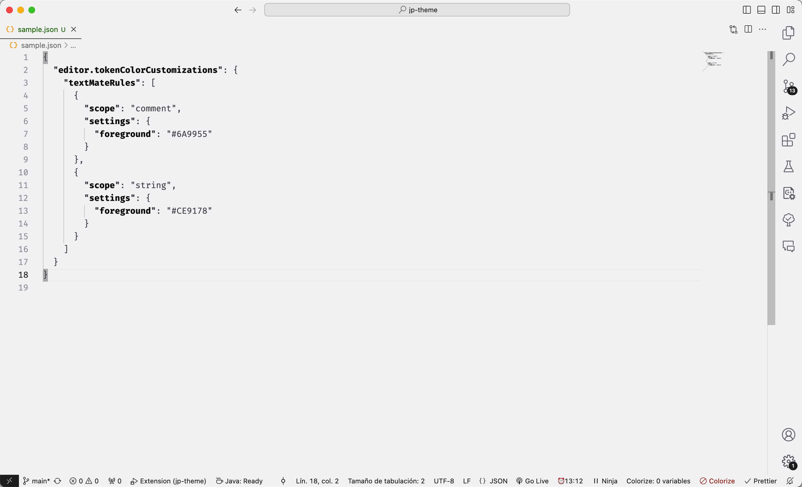
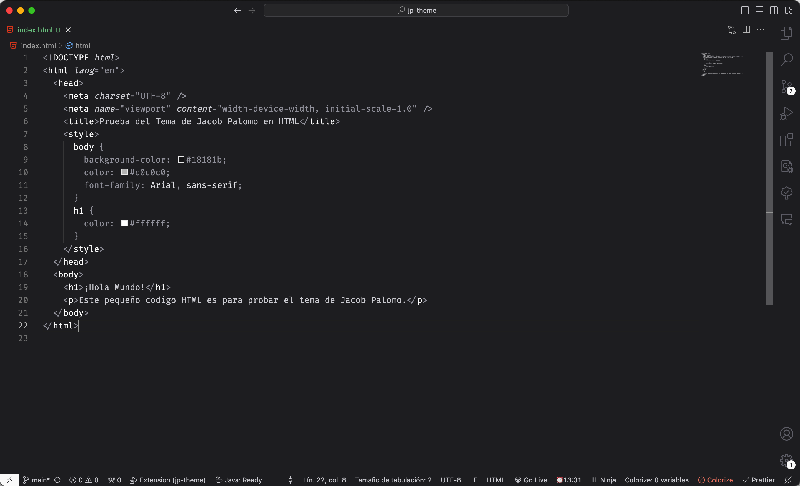
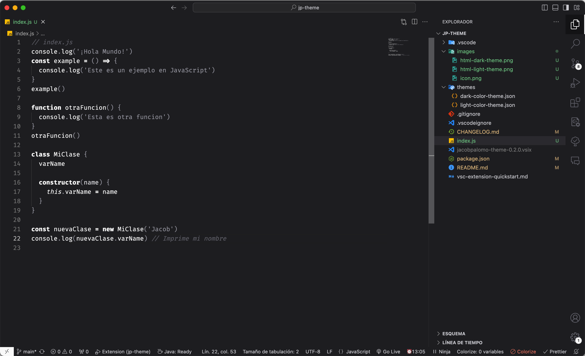
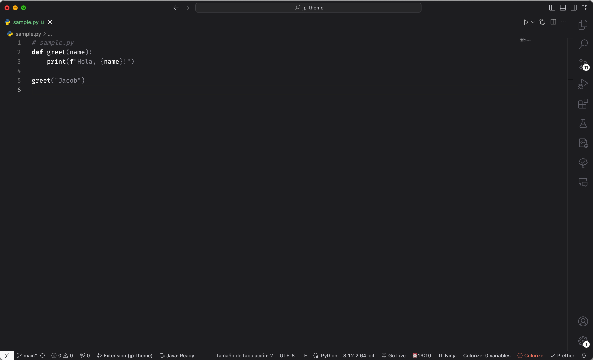
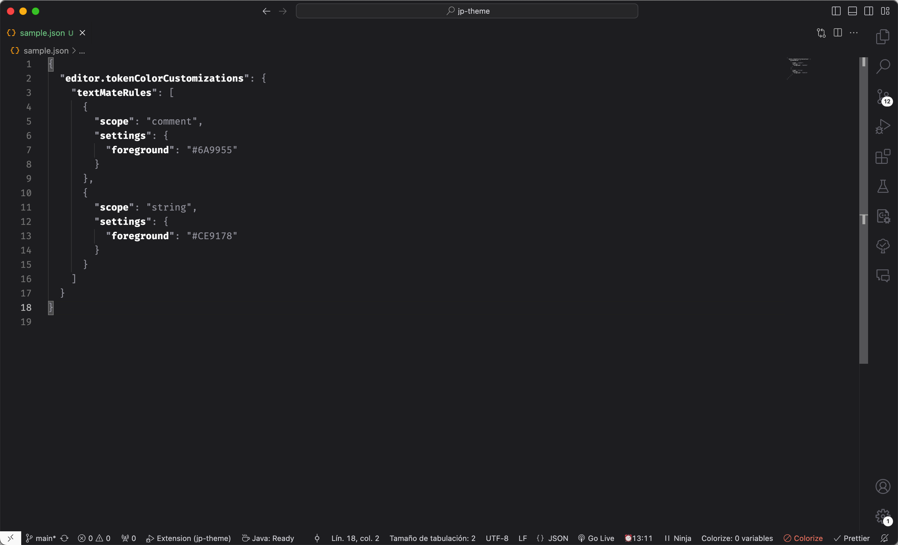

# Jacob Palomo Theme for VSCode

Esta extensión incluye el tema claro y oscuro que utilizo para trabajar día a día.

## Instalación

Esta extensión se puede instalar a través de la barra lateral de extensiones buscando "jacobpalomo-theme" o presionando Apertura rápida (⌘+P) y ejecutándo `ext install jacobpalomo-theme`.

## Capturas de pantalla

### Light theme

#### HTML / CSS

#### JavaScript

#### Python

#### JSON

### Dark theme

#### HTML / CSS

#### JavaScript

#### Python

#### JSON

